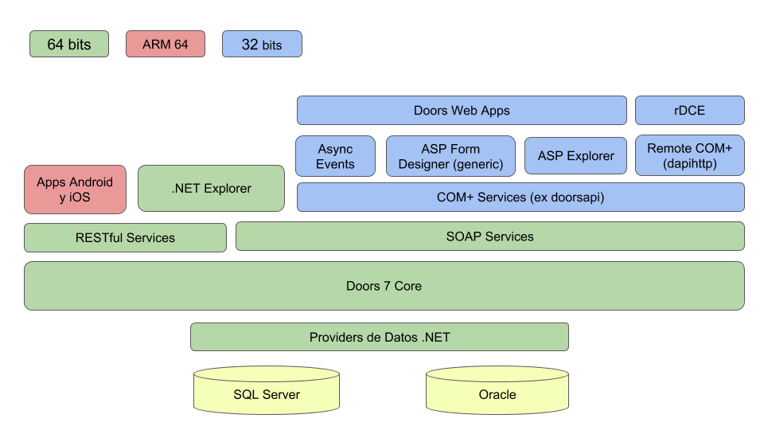

# Cloudy Doors BPM 7 - Documentación Técnica


> **⚠️ DOCUMENTACIÓN HISTÓRICA (v7):** Esta documentación corresponde a Cloudy Doors BPM versión 7. En versiones posteriores (v8, Fluye) la arquitectura, APIs y comportamientos pueden diferir significativamente. Usar como referencia conceptual, pero siempre verificar contra la implementación actual antes de aplicar.

---

## Índice de Contenidos

- [Introducción](#introducción)
- [Novedades de la versión 7](#novedades-de-la-versión-7)
- [Arquitectura](#arquitectura)
  - [Descripción de Componentes](#descripción-de-componentes)
- [Instalación](#instalación)
  - [Requerimientos del sistema](#requerimientos-del-sistema)
  - [Configuración de permisos](#configuración-de-permisos)
  - [Actualización de una instalación 5.1](#actualización-de-una-instalación-51)
  - [Base Master e Instancias](#base-master-e-instancias)
- [Inicio de sesión](#inicio-de-sesión)
- [Administración](#administración)
  - [Administración de usuarios y grupos](#administración-de-usuarios-y-grupos)
  - [Permisos](#permisos)
  - [Herencia de permisos](#herencia-de-permisos)
  - [Políticas](#políticas)
  - [Settings](#settings)
  - [Licencias y conexiones](#licencias-y-conexiones)
  - [Logs de auditoría](#logs-de-auditoría)
  - [Backup y recupero](#backup-y-recupero)
  - [Performance tips](#performance-tips)
- [Tree View Explorer](#tree-view-explorer)
  - [Organizar Favoritos](#organizar-favoritos)
- [Responsive Explorer](#responsive-explorer)
  - [Responsive Explorer en el Desktop](#responsive-explorer-en-el-desktop)
  - [Responsive Explorer en el Teléfono](#responsive-explorer-en-el-teléfono)
- [Creación de aplicaciones](#creación-de-aplicaciones)
  - [Conocimientos previos necesarios](#conocimientos-previos-necesarios)
  - [Diseño](#diseño)
  - [Forms](#forms)
  - [Folders](#folders)
  - [Documents](#documents)
  - [Views](#views)
  - [Dashboards](#dashboards)
  - [Creando interfaces de formularios](#creando-interfaces-de-formularios)
  - [Escribiendo el workflow](#escribiendo-el-workflow)
  - [Importación de datos](#importación-de-datos)
  - [Remote DCE - Generación de Instaladores](#remote-dce---generación-de-instaladores)
- [APIs](#apis)
  - [APIs COM](#apis-com)
  - [APIs SOAP](#apis-soap)
  - [APIs RESTful](#apis-restful)
- [Tareas en background / Eventos asíncronos](#tareas-en-background--eventos-asíncronos)

---

# Introducción

Cloudy BPM (aka Doors) es un entorno de desarrollo para aplicaciones de tipo documental. En líneas generales, se trata de un repositorio de documentos organizados en una estructura jerárquica de carpetas. DOORS significa Document Oriented Relational Storage (Repositorio Relacional Orientado a Documentos), ya que corre sobre un motor de base de datos relacional.

Doors fue creado a partir de varios años de experiencia en el desarrollo de aplicaciones sobre Lotus Notes + Domino y MS Outlook + Exchange, de los cuales se tomaron muchos conceptos referidos al desarrollo de aplicaciones colaborativas (ver [Una visión de Doors para CIOs](vision_cio.md)).

Doors fue pensado para dar soporte a las denominadas aplicaciones basadas en documentos, en las cuales la información se encuentra almacenada en formatos no estructurados, como párrafos de texto con formato y archivos adjuntos. Las aplicaciones basadas en documentos son también conocidas como aplicaciones basadas en la comunicación (communication-centric), como contraparte de las aplicaciones basadas en datos (data-centric), que manejan unidades pequeñas de información (generalmente números o códigos alfanuméricos) en un gran número de transacciones, y con un fuerte control de integridad.

Doors es un framework que facilita el desarrollo de aplicaciones documentales proveyendo las siguientes herramientas:

- Provee una estructura jerárquica de carpetas que almacenan documentos.
- Cada documento es una unidad de información equivalente a un registro en una base de datos.
- Los documentos pueden tener distintos atributos (campos).
- Mantiene un directorio de usuarios y grupos anidables.
- Permite asignar permisos de lectura, escritura, borrado y administración a nivel de documento, y heredables desde objetos contenedores.
- Provee un diseñador de interfaces para la visualización y edición de documentos.
- Permite especificar la lógica de negocios en eventos similares a triggers, codificables con lenguaje de scripting.
- Provee herramientas para desarrollo y gestión de configuración.
- Soporta búsquedas de texto (text-search) sobre el repositorio completo.
- Provee autenticación nativa, y autenticación integrada con Active Directory y/o LDAP.
- Permite la creación de vistas en formato tablero o en formato gráfico, en cada carpeta.
- Es 100% web responsive.
- Es compatible con bases de datos Oracle o SQL Server.
- Soporta diferentes idiomas y usos horarios, seleccionables por usuario.
- Incorpora un fuerte sistema de trazabilidad, compatible con los estándares del sector financiero.
- Maneja e indexa archivos adjuntos y campos HTML en los documentos.
- Provee funciones de envío de notificaciones push y mailing.
- Provee servicios para la calendarización de actividades recurrentes en background.
- Provee Interfaces SOA, REST y COM+ para una integración simple y en tiempo real con sus sistemas.
- Exporta e importa datos desde archivos Excel.
- Es altamente escalable.

---

# Novedades de la versión 7

- Vistas gráficas.
- Papelera de documentos eliminados y posibilidad de recuperarlos.
- Arquitectura SOA.
- Soporte para plataforma de 64 bits.
- Soporte para dispositivos Android, iPhone y Blackberry.
- Soporte para distintos navegadores y plataformas.

---

# Arquitectura



## Descripción de Componentes

- **Doors Web Apps:** Aplicaciones Web Basadas en Doors.
- **rDCE:** Editor Código de Doors y Generación de Instaladores.
- **Remote COM+ (dapihttp):** Biblioteca de Servicios COM+ via HTTP.
- **ASP Form Designer (generic):** Diseñador de interfaces para forms basado en generic + controls (ASP).
- **Async Events:** Servicios de eventos asíncronos escritos en VBScript.
- **ASP Explorer:** Arbol, Adm de Usuarios, Adm de Forms, Ventanas de propiedades de folder y document.
- **Apps Android y iOS:** Contact Manager. Colectora para Distribuidores. CRM Inmobiliario.
- **.NET Explorer:** Vistas, Adm de Vistas, Export.
- **COM+ Services (ex doorsapi):** Wrapper COM+ para los servicios del CORE. Desarrollada para ofrecer compatibilidad legacy.
- **SOAP Services:** Servicios WCF con arquitectura SOA, y protocolo SOAP.
- **RESTful Services:** Servicios WCF REST según estándar RESTful.
- **Doors 7 Core:** Núcleo de Doors, motor de documentos y eventos síncronos.
- **Providers de Datos .NET:** Librerías de conexión a datos.
- **SQL Server y Oracle:** Motores de Base de Datos.

---

# Instalación

## Requerimientos del sistema

### Application Server

**Requisitos de Hardware (mínimos/recomendados):**

- Procesador: Xeon o superior.
- Memoria: 8 Gb RAM.
- Espacio en disco: 50 Gb libres + lo estimado para adjuntos externos.

**Requisitos de Software:**

- Windows 2008 R2 (o posterior) 64 bits con IIS activo.
- Microsoft WCF Memory Hotfix (incluido en el paquete de instalación).
- Microsoft .NET Framework 4.0.

### Database Server

- SQL Server 2008 R2 (o posterior, en cualquiera de sus versiones, incluyendo la Express).
- Oracle 10 o superior (o posterior, en cualquiera de sus versiones, incluyendo la Express).

NOTA: para instalaciones con Cubos, la versión de SQL debe tener Analysis Services. Revise las versiones y sus características [aquí](http://www.microsoft.com/es-es/sqlserver/product-info/compare.aspx).

NOTA: para conocer los requerimientos de hardware y software del servidor de base de datos consulte la documentación del fabricante (Microsoft / Oracle).

### Clientes

**PC:**

- Google Chrome 70 o superior.
- Mozilla Firefox 65 o superior.
- Edge 75 o superior.
- Safari 10 o superior.

**Smartphones y tablets:**

- Android 7 o superior.
- iOS 10.x o superior.

## Instalación

La instalación de Doors 7 está formada por 2 pasos fundamentales:

1. Creación e instalación de la base de datos.
2. Instalación y configuración de la aplicación.

Para el creado e instalación de la base de datos, deberá tomar la base de datos obtenida del proveedor y levantarla en el servidor de base de datos correspondiente (SQL Server u Oracle).

Para la instalación y configuración de la aplicación, deberá seguir los pasos presentados [aquí](instalacion.md).

## Configuración de permisos

### Servicios Doors

- Gestar.Doors.Server: LocalSystem
- Gestar.File.Server: LocalSystem
- Gestar Timer Events: LocalSystem
- Gestar Trigger Events: LocalSystem

### Gestar Components

El usuario asignado al paquete de Servicios de Componentes de Gestar debe poseer los siguientes privilegios:

- Inicio de sesión como servicio.
- Miembro del grupo local Usuarios.
- Permisos de lectura y escritura en la carpeta de instalación de Doors.

Para asignar el usuario ir a Inicio -> Herramientas administrativas -> Servicios de componentes y expandir Servicios de componentes -> Equipos -> Mi Equipo -> Aplicaciones COM+, hacer click derecho en la aplicación Doors y seleccionar Propiedades, cambiar a la solapa Identidad y cambiar el usuario de la aplicación.

Nota: Si el paquete de componentes queda en Interactive user (opción de inicio por defecto), no funcionará sino hay un usuario logueado en el equipo.

### Pool IIS

- NET.TCP or BasicHttp: AppPoolIdentity.
- NamedPipes: LocalSystem + AppPool Authentication.

## Actualización de una instalación 5.1

Para actualizar Doors 5.1 a la versión 7.0 se deberán seguir 2 pasos fundamentales:

1. [Migración de la base de datos](migracion_bd.md)
2. [Actualización de la aplicación](actualizacion.md)

## Base Master e Instancias

La plataforma de Doors permite trabajar dentro de una misma instalación con varias bases de datos, manejando independientemente sus:

- Aplicaciones.
- Listado de usuarios.
- Configuración.

Esto nos permite por ejemplo, tener en una instalación una base de datos distinta para cada cliente o armar un entorno de Desarrollo/Testing adicional.

Para esto Doors maneja el concepto de base de datos MASTER y base de datos de INSTANCIA. Para configurar base de datos de instancia y master, acceda a [este tutorial](master_instancias.md).

---

# Inicio de sesión

Para iniciar sesión, primero se deberá abrir un navegador de internet, ingresar la página web donde se encuentra instalada la aplicación y presionar "Enter". Luego de completar los datos que se piden, nombre de usuario, contraseña e instancia asignada, seleccionar "Iniciar Sesión".

---

# Administración

## Administración de usuarios y grupos

### Entendiendo la estructura de Grupos y Usuarios de Doors

Doors cuenta con un completo sistema para la administración de seguridad sobre todos sus elementos, sean éstos documentos, carpetas, formularios, vistas, etc.

El sistema de seguridad y acceso se compone de cuentas de usuarios que pueden pertenecer a grupos, lo cual les confiere permisos para realizar operaciones sobre aquellos elementos para los cuales el grupo tenga permisos. La estructura de usuarios y grupos se puede ver que no admite restricciones en cuanto a la conformación de los grupos ni en cuanto a la pertenencia de un usuario a más de un grupo por lo que se puede construir la estructura que se desee.

Un usuario puede pertenecer a más de un grupo y un grupo puede a su vez pertenecer a otros grupos. Un usuario puede pertenecer a un grupo de manera explícita (está asignado al mismo), o heredada (grupos que no tiene de manera directa pero si los grupos a los que pertenece).

Por ejemplo, la siguiente figura ilustra una estructura de grupos típica.

En este ejemplo tenemos un grupo para cada Área (Producción, Calidad, etc), dentro de las áreas hay grupos de gerentes y operarios. A su vez, todos los grupos de gerentes pertenecen a un grupo Gerentes y hay un grupo global (Toda la organización) que contiene todos estos grupos.

Ej:

- Un permiso asignado al grupo Gerentes aplicará a los gerentes de todas las áreas.
- Un permiso asignado al grupo Calidad aplicará a los gerentes y operarios de esa área.

Estos grupos se utilizan para la asignación de permisos a los objetos de Doors (documentos, carpetas, vistas y formularios). Citemos algunos ejemplos de permisos sobre un documento:

- Un documento de libre lectura a toda persona de la organización como políticas, declaración de misión, visión, etc, debe tener permiso de lectura asignado al grupo "Toda la organización" y puesto que este grupo contiene a todos los demás grupos (cualquier usuario que pertenece a algún grupo pertenece indirectamente al grupo "Toda la organización"), todos los usuarios tendrán acceso de lectura a este documento.
- Un documento de libre lectura a todo usuario perteneciente al área de producción (grupo producción) debe tener permiso de lectura asignado a este grupo.
- Un documento de consulta de los niveles gerenciales debe tener permiso de lectura para el grupo Gerentes de este modo y dado que todo usuario en alguno de los grupos de gerentes (calidad, producción, comercial) pertenece indirectamente al grupo Gerentes, todos estos usuarios podrán acceder al documento.
- Un documento confidencial que sólo deba verlo el director de la organización debe tener permiso de lectura sólo para el "usuario" director y ningún otro.
- Si a un documento deben poder consultarlo los gerentes comerciales y el director de la organización, entonces este documento debe tener permisos de lectura para el grupo Gerente Comercial y para el usuario director.

### Tipos de Cuentas

Doors cuenta con distintos tipos de cuentas para el manejo organizado de la aplicación. Los distintos tipos de cuentas son:

- Cuentas de Usuario.
- Cuentas de Grupo.
- Cuentas Especiales.

A su vez, una cuenta puede ser de sistema o no. A continuación, se explican los tipos de cuentas y el detalle de cada una:

Las cuentas especiales son:

| Cuenta | ID | Nombre | Descripción |
|---|---|---|---|
| Creador | -2 | Creator Owner | Representa al creador de un documento, carpeta, vista o formulario. |
| Todos | -1 | Everyone | Se utiliza para asignar permisos sobre un objeto a todos los usuarios del sistema. |

Las cuentas de sistema incluyen, a parte de las cuentas especiales, las siguientes cuentas:

| Cuenta | ID | Nombre | Descripción |
|---|---|---|---|
| Administrador | 0 | Administrator | Este usuario tiene permisos ilimitados sobre todos los objetos |
| Administradores | 1000000 | Administrators | Todos los miembros pertenecientes directa o indirectamente a este grupo de usuarios tienen permisos ilimitados sobre todos los objetos |

### Administrador de Usuarios

#### Navegando por la estructura de grupos

Al ingresar al Administrador de Usuarios, dentro de Carpetas del Sistema; se muestran tres paneles en la parte principal de la pantalla:

- **Cuentas:** en este panel ubicado en el marco superior derecho de la pantalla, se visualizan todos los usuarios y grupos de la aplicación.
- **Miembros:** el panel se encuentra ubicado en la parte inferior izquierda de la pantalla, y aquí se observan todos los usuarios o grupos de usuarios que forman parte de un grupo señalado en el panel de Cuentas.
- **Miembro de:** en este panel localizado en la parte inferior derecha de la pantalla, se visualiza el o los grupos a los cuales pertenece el usuario o grupo seleccionado en el panel de Cuentas.

Ejemplo: en la siguiente pantalla se muestra un ejemplo de las relaciones entre usuarios y grupos:

En donde se puede apreciar la estructura del grupo "Administradores", el cual tiene como miembros a todos los usuarios que aparecen en la parte superior del panel de la derecha y a su vez, es miembro de otro grupo, "CRM Colaboradores", que se lo visualiza en la parte inferior del panel de la derecha.

#### Criterios para el armado de la estructura de grupos

Doors permite la coexistencia de más de una estructura de grupos para organizar los usuarios. Estas estructuras paralelas pueden ser de cualquier tipo siendo las más comunes las estructuras verticales, horizontales, vertical-horizontal acotadas y organizadas por roles o tareas. Explicamos cada una de ellas:

- **Estructura vertical:** es aquella que refleja la estructura jerárquica de la organización mediante grupos grandes que contienen grupos más pequeños en el que cada grupo representa un área y cada área contiene a sus grupos departamentos y cada departamento sus oficinas y cada oficina su gente.
- **Estructura horizontal:** es aquella que refleja estratos de una jerarquía como por ejemplo el grupo directores, gerentes, jefes y operarios.
- **Estructura vertical-horizontal:** es aquella que refleja un segmento horizontal dentro de uno vertical como por ejemplo jefes de producción. Esta es la intersección del grupo vertical área de producción y grupo horizontal jefes.
- **Estructura por roles o tareas:** es aquella que se forma para que sus integrantes puedan realizar determinadas tareas. Por ejemplo si una tarea es facturar, entonces se crea el grupo facturadores y se inserta en él a los usuarios que realizan la tarea de facturar.

#### Crear un nuevo Grupo

Para crear un nuevo grupo realizar los siguientes pasos:

1. Seleccionar la carpeta "Administrador de usuarios" dentro de las Carpetas del sistema, seleccionar la opción "Nuevo Grupo".

2. Al abrirse la siguiente pantalla, deberá ingresar en la solapa "General" el Nombre del Grupo, Descripción y una dirección de Correo Electrónico común para todos los integrantes del grupo.

   Nota: Un grupo puede no tener correo electrónico, en este caso cuando se envía un mail al grupo usando el API de Doors el correo se enviará a todos sus miembros.

3. En la segunda solapa "Miembros" se deben agregar los integrantes del grupo, los cuales pueden ser usuarios o bien otros grupos.

4. Para agregar un miembro al grupo, debe escribir el nombre de usuario/grupo y el sistema le mostrará las coincidencias.

5. Seleccionar la cuenta deseada que se quiere agregar al grupo.

6. En la solapa "Miembro De" podrá visualizar los grupos a los que pertenece esta cuenta. Finalmente, oprima el botón "Guardar" para confirmar la creación del Nuevo Grupo y sus integrantes.

#### Crear un Nuevo Usuario

Para crear un Nuevo Usuario presionar la opción "Nuevo Usuario", tal como se muestra en la siguiente imagen:

1. En la solapa "General", deberá completar la siguiente información:

   | Campo | Descripción |
   |---|---|
   | Nombre completo | Nombre "real" de la persona. Por regla este se registra como Nombre y Apellido. Ejemplo: Ramiro Esquivel |
   | Descripción | Espacio para registrar información adicional sobre el usuario. |
   | Email | Dirección de correo utilizada por el usuario. Recuerde que Gestar se comunica por medio de email y utiliza estas direcciones. |
   | Idioma | Determina el lenguaje de las cadenas de texto y los formatos de fechas y números. |
   | Diferencia horaria | Establece la diferencia horaria que tiene el usuario respecto al servidor. Ej si el servidor se encuentra en GMT-3 y el usuario en GMT+1, la diferencia horaria será 4. |

2. En la solapa "Inicio de sesión" deberá completar los siguientes campos:

   | Campo | Descripción |
   |---|---|
   | Cuenta deshabilitada | Permite impedir el acceso al sistema sin borrar la cuenta. |
   | Permitir autenticación NT | Permite que los usuarios puedan acceder al sistema utilizando la autenticación de Windows con IIS. El login de Doors debe ser igual al login de Windows. |
   | Permitir autenticación Adfs | En caso de tener integración con Active Directory Federation Services tildar esta opción para usar este tipo de autenticación. |
   | Permitir login manual | Permite que los usuarios puedan acceder al sistema ingresando la contraseña. Hay dos métodos de validación de la misma. |
   | Nombre de usuario | Nombre utilizado por el usuario para ingresar al sistema (login). Por regla este se compone de la inicial del nombre seguido del apellido. Ejemplo resquivel. |
   | Gestar | Gestar Doors almacenará la contraseña y validará el inicio de sesión. Doors almacena las contraseñas de usuarios mediante un algoritmo de solo ida, es decir que no pueden desencriptarse. |
   | Contraseña / Confirmar contraseña | La clave del usuario. |
   | No puede cambiar la contraseña | Activar en casos en que se desee impedir que el usuario cambie la contraseña. Esto puede ser necesario en casos que se cuente con usuarios que sean utilizados por otros sistemas para interactuar con Gestar y cuya clave de acceso se encuentre hardcode. |
   | Debe cambiar la contraseña la próxima vez que se loguee | Es una opción común en las altas de usuarios. En este caso el administrador le asigna una contraseña para que entre al sistema y este obliga al usuario a cambiarla inmediatamente. |
   | La contraseña no expira | Pasa por alto el tiempo de duración máximo de las contraseñas |
   | LDAP Server | Valida la contraseña contra un servidor LDAP (ver Configuración de Servidores LDAP más abajo) |
   | Api Key | Opción para generar una clave de acceso API en integraciones. |

3. Seleccionando la solapa "Miembro de" se puede especificar a qué grupo/s pertenece este nuevo usuario. Ingresar el nombre del grupo o parte del mismo para que el sistema le muestre las coincidencias.

   Seleccionar el grupo deseado y por último presionar "Guardar" para confirmar la creación del usuario.

#### Eliminar Usuarios/Grupos

Para eliminar un usuario o un grupo registrado, dentro de las Carpetas del Sistema, "Administrador de Usuarios", buscar la cuenta del usuario/grupo que desea borrar y presionar el ícono "Eliminar". Tal como se muestra en la siguiente imagen de pantalla:

Finalmente, para confirmar la operación de Eliminación de la cuenta del Usuario/Grupo, presionar el botón "Borrar" del mensaje que aparecerá en pantalla.

En el caso de los usuarios, si estos son propietarios de objetos no podrá eliminarse excepto que se tilde la opción "Expropiar la información de esta cuenta", la cual transfiere la propiedad de todos esos objetos al usuario que ejecuta la acción.

### Configuración de Servidores LDAP

La conexión a servidores LDAP ocurre desde el servidor de aplicaciones de Doors usando APIs .NET v4.0. Soporte SSL disponible con infraestructura PKI en Active Directory. Autenticación Kerberos no disponible para dominios no-trusted.

**Acceso:** "Administrador de Configuraciones" → "Servidores LDAP"

**Campos:** Nombre del servidor, Dirección DNS/IP, SSL (checkbox), Eliminar servidor, Crear nuevo servidor, Probar conexión.

## Permisos

Los permisos son privilegios que se asignan a las cuentas de usuarios y grupos sobre los objetos de Doors. Los objetos capaces de recibir permisos son los siguientes:

- **Forms:** Un form (formulario) define una estructura para un conjunto de documentos. Esta estructura consiste básicamente en una lista de campos, un formato de presentación y un workflow (reglas de negocios que definen su comportamiento ante cambios). Haciendo una analogía con los formularios en papel, un form es una plantilla a partir de la cual se crearán múltiples documentos. Ej: formularios de inscripción, formularios de reclamo, formularios de consultas, etc. Al igual que en papel, un formulario completado con datos es un documento. Para más información acerca de los permisos en forms de Doors [haga click aquí](formularios.md).

- **Folders:** Los folders (carpetas) son unidades de almacenamiento que se organizan en una estructura jerárquica (padre-hijo). Los folders pueden ser de tipo Vínculo (apuntan a una página web, la cual es cargada en el panel de visualización) o de tipo Documentos (almacenan documentos de un Form o plantilla definido). Para más información acerca de los permisos en carpetas de Doors [haga click aquí](carpetas.md).

- **Documents:** Los documents (documentos) son instancias de un Form (plantilla) específico, completado con datos, y almacenados en una carpeta. Para más información acerca de los permisos en documentos de Doors [haga click aquí](documentos.md).

- **Views:** Los views (vistas) son distintas formas de visualizar el contenido de una carpeta de documentos. Una vista define campos, filtros, criterios de ordenamiento y agrupación y otros parámetros que permiten presentar la información de manera adecuada según la necesidad. Para más información acerca de los permisos en vistas de Doors [haga click aquí](vistas.md).

En el capítulo de creación de aplicaciones podrá encontrar mayor información acerca de los permisos sobre los distintos objetos.

### Herencia de permisos

Las carpetas, documentos y vistas pueden heredar los permisos del objeto padre además de tener permisos propios. Las modificaciones en los permisos heredables se reflejan inmediatamente en los objetos que hereden, sin necesidad de propagarlos y reemplazar los permisos existentes. Cada objeto tiene un Acl propio (AclOwn) y un Acl heredado (AclInherited). La suma de ambos constituye el Acl efectivo el objeto. Para cada objeto que hereda permisos el AclInherited será igual al Acl del objeto padre.

Dada la siguiente estructura carpetas y permisos:

```
-Folder1 (AclOwn=A)
  -- Folder2 (Hereda=SI; AclOwn=B; Acl=AB)
    --- Folder3 (Hereda=SI; AclOwn=C; Acl=ABC)
```

Si Folder2 deja de heredar:

```
-Folder1 (AclOwn=A)
  -- Folder2 (Hereda=NO; AclOwn=B; Acl=B)
    --- Folder3 (Hereda=SI; AclOwn=C; Acl=BC)
```

Si Folder2 vuelve a heredar y Folder3 agrega el permiso D:

```
-Folder1 (AclOwn=A)
  -- Folder2 (Hereda=SI; AclOwn=B; Acl=AB)
    --- Folder3 (Hereda=SI; AclOwn=CD; Acl=ABCD)
```

Si Folder3 rompe la herencia y Folder1 agrega el permiso E:

```
-Folder1 (AclOwn=AE)
  -- Folder2 (Hereda=SI; AclOwn=B; Acl=ABE)
    --- Folder3 (Hereda=NO; AclOwn=CD; Acl=CD)
```

## Políticas

Las políticas son derechos administrativos que pueden asignarse a los usuarios de manera que estos pueden efectuar la función sin necesidad de ser administradores.

Las políticas se implementan como permisos en las carpetas del sistema asociadas a las acciones:

| Política | Carpeta | Acceso |
|---|---|---|
| Crear nuevas cuentas | SystemFolders/UserManager (ID 3) | doc_create |
| Modificar cuentas | SystemFolders/UserManager (ID 3) | doc_modify |
| Borrar cuentas | SystemFolders/UserManager (ID 3) | doc_delete |
| Crear Forms | SystemFolders/Forms (ID 5) | doc_create |
| Eliminar conexiones | SystemFolders/Connections (ID 6) | doc_delete |

Notas:

- Los usuarios deben tener el permiso fld_read en la carpeta asociada a la política.
- Al crear un nuevo Form, se le asignan todos los permisos al CreatorOwner.

De esta manera para que un usuario pueda crear nuevas cuentas debe poseer permiso para crear documentos en la carpeta "SystemFolders/UserManager" aunque los usuarios no sean en verdad documentos sino objetos del sistema.

## Settings

Los Settings o Parámetros de Doors son valores asociados a un identificador que permiten especificar distintos aspectos de configuración de Doors.

Estos settings se almacenan en la tabla SYS_SETTINGS de la base de datos de Doors y es posible especificarlos también en el archivo doors.ini del directorio /Bin del directorio de instalación.

Estos settings son:

| Código | Descripción |
|---|---|
| ATTACHMENTS_EXTERNAL (Instancia) | Especifica si los archivos adjuntos deben almacenarse fuera de la base de datos o no. Para indicar que deben guardarse fuera de la base de datos debe establecerse el valor de este setting a 1, cualquier otro valor de este o bien su ausencia significa que los archivos adjuntos se almacenarán dentro de la base de datos. |
| ATTACHMENTS_PATH (Master) | Especifica la ruta al directorio donde se guardarán los archivos adjuntos cuando el setting ATTACHMENTS_EXTERNAL se ha establecido a 1. Por ejemplo "c:\archivos de programa\gestar\attachments". |
| SCRIPT_TIMEOUT (Instancia) | Especifica el tiempo máximo en milisegundos que el control Microsoft Script Control podrá ejecutar un script de eventos síncronos antes de lanzar un error de ScriptTimeOut. Para quitar esta restricción de tiempo y permitir que un script corra sin límites de tiempo se debe establecer esta propiedad a -1. Ver [Session.ScriptTimeOut](http://www.gestar.com/wiki/index.php?title=Objeto_Session#ScriptTimeOut) |
| CHECK_CONN_SPAN (Instancia) | Tiempo en milisegundos en el que la aplicación mide el estado de la conexión al servidor. |
| MIN_BANDWIDTH (Instancia) | Valor en Mb/s para verificar el valor mínimo aceptable de la conexión a internet. |
| MAX_VIEW_SEARCH_RECORDS | Especifica limite de cantidad de documentos que aplican las vistas que no tienen definido un valor en cantidad máxima de registros. |
| MIN_PASSWORD_LENGTH (Instancia) | Especifica la longitud mínima requerida para una clave de usuario. Este parámetro tiene una validez local a la instancia en donde se declara. |
| INSTANCE_GUID (Instancia) | Especifica un ID único para la base de datos. Ver [Session.InstanceGUID](http://www.gestar.com/wiki/index.php?title=Objeto_Session#InstanceGuid) |
| INSTANCE_DESCRIPTION (Instancia) | Especifica una descripción para la instancia que alberga la base de datos. Ver [Session.InstanceDescription](http://www.gestar.com/wiki/index.php?title=Objeto_Session#InstanceDescription) |
| IDLE_SESSION_LIMIT (Master) | Especifica el tiempo máximo en minutos que una sesión puede estar inactiva antes de desconectarla. Si no se indica un valor en este setting o bien este no existe, por defecto el tiempo límite de sesión se establece a 20 minutos. Ver [Session.IdleSessionLimit](http://www.gestar.com/wiki/index.php?title=Objeto_Session#IdleSessionLimit) |
| CDO_CONFIGURATION (Master) | Especifica la cadena de configuración para el envío de mails. Ver: [Cdo Configuration](http://www.gestar.com/wiki/index.php?title=Configuraci%C3%B3n_Avanzada#Cdo_Configuration) y [Session.CdoConfiguration](http://www.gestar.com/wiki/index.php?title=Objeto_Session#CdoConfiguration). Ejemplo de configuración con Pickup Directory: `sendusing=1;smtpserverpickupdirectory=c:\inetpub\mailroot\pickup`. Ejemplo de configuración con SMTP: `sendusing=2;smtpserver=myserver;smtpserverport=25` |
| LICENSE (Master) | Contiene una cadena con la licencia del producto. Ver: [Session.License](http://www.gestar.com/wiki/index.php?title=Objeto_Session#License), [Session.LicenseAdd](http://www.gestar.com/wiki/index.php?title=Objeto_Session#LicenseAdd), [Session.LicenseInfo](http://www.gestar.com/wiki/index.php?title=Objeto_Session#LicenseInfo) |
| MAX_SECONDS_SQLTRACE | Especifica el tiempo máximo en segundos antes de trazar la consulta. Este parámetro se utiliza para identificar las consultas que demoran en ejecutarse por encima del valor especificado. |
| OPTION_STRICT (Master) | Especifica si Doors debe realizar validaciones de tipos sobre los valores que se intentan asignar a los campos de los documentos. Para activar este comportamiento debe setearse este setting a 1. Ver: [Session.OptionStrict](http://www.gestar.com/wiki/index.php?title=Objeto_Session#OptionStrict) |
| MAX_DOCUMENT_LOG_LENGTH (Instancia) | Especifica el tamaño máximo en bytes que pueden guardarse en el logs de campos cada vez que se modifica un valor. Si no se especifica un valor, todo el valor nuevo y anterior se podrá guardar en forma completa. Ver: [Session.MaxDocLogLen](http://www.gestar.com/wiki/index.php?title=Objeto_Session#MaxDocLogLen) |
| LANGUAGE (Instancia) | Especifica el código de idioma que se utilizará al ingresar a Doors por defecto. Si este parámetro no existe se toma por defecto el idioma Inglés. |
| MIN_PASSWORD_AGE (Instancia) | Especifica el tiempo mínimo que debe transcurrir desde la última vez que se cambió la clave de usuario para poderla volver a cambiar. Este parámetro se utiliza para establecer las políticas de tiempo mínimo entre cambios de claves de acceso (passwords). |
| MAX_PASSWORD_AGE (Instancia) | Especifica el tiempo máximo de validez de las claves de usuarios. Cuando se especifica un tiempo en este parámetro, cada vez que un usuario se loguea se verifica si es tiempo de cambiar el password y si es así se obliga a que se realice este cambio. Este parámetro se utiliza para establecer las políticas de tiempo máximo entre cambios de claves de acceso (passwords). |
| ASP_WEB_FOLDER (Instancia) | Especifica el nombre de application com que utiliza la instancia, en una instalación estándar el valor es c. |
| INSTANCE_LOGO_IMAGE (Instancia) | Especifica la imagen logo de la instancia que se muestra en la pantalla principal de la aplicación. |
| MAX_LENGHT_FORM_FIELDNAME (Instancia) | Especifica el tamaño máximo de caracteres que se permite en el nombre de un campo / field en los formularios / CustomForms. |
| INSTANCE_INPUT_CONTROL_TYPE (Master) | Especifica el tipo de control para seleccionar la instancia que se muestra en la pantalla de login, los valores posibles TEXTBOX o DROPDOWNLIST. |
| VIEW_MAX_DOCS_HELP | Link al artículo con información de por qué se muestran pocos registros en la vista. |

## Licencias y conexiones

### Licencias

Una licencia es un código encriptado suministrado por el proveedor que habilita la operación sobre Doors de un número de usuarios concurrentes por un período de tiempo determinado. Es posible tener más de una licencia registrada para incrementar el número de conexiones permitidas y/o extender el plazo de operación del sistema.

Si no se poseen licencias solo se puede ingresar al sistema mediante el usuario de sistema "admin".

Las licencias se administran desde la pantalla de licencias a la cual se tiene acceso seleccionando la carpeta "Administrador de licencias" de las "Carpetas del sistema" como se muestra en la figura de abajo.

En esta pantalla se observan los datos de las licencias registradas. Estos son:

- Descripción.
- Cantidad de conexiones concurrentes que admite el sistema.
- Fecha de emisión de la licencia.
- Fecha de ingreso o registración de la licencia en el sistema.
- Fecha en que caduca la licencia.

#### Solicitar una licencia

Para solicitar una licencia se debe seleccionar la opción "Solicitar" del menú "Licencias".

**Si no se cuenta con una licencia registrada:**

Se mostrará una pantalla que visualizará un formulario a completar para realizar la solicitud de la primera licencia. Los campos a completar son:

- Destinatario: dirección de correo electrónico del contacto del proveedor a quien le llegará el mail de solicitud.
- Nombre: Nombre completo de la persona solicitante o del contacto dentro de la empresa solicitante.
- Compañía: Razón social de la organización solicitante.
- Cantidad: Cantidad de conexiones concurrentes que se desean.
- Comentarios: Cualquier información relevante relacionada a la solicitud.

Luego de completados los datos en la pantalla se debe presionar el botón "enviar".

**Si ya existen licencias registradas:**

En este caso, se mostrará la siguiente pantalla:

Este formulario debe completarse para realizar la solicitud de licencias posteriores. Los campos a completar son:

- Destinatario: dirección de correo electrónico del contacto del proveedor a quien le llegará el mail de solicitud.
- Código de licencia actual: es el código de la licencia que se encuentra registrada en el momento. Este campo se completa automáticamente.
- Cantidad: cantidad de conexiones concurrentes que se desean.

Luego de completar los datos en la pantalla se debe presionar el botón "enviar".

#### Registrar una licencia

Una vez que se cuenta con el código de una licencia se debe dirigir a la pantalla de registración de licencia. Para esto se debe seleccionar la opción "Agregar" del menú "Licencias" y se presentará la siguiente pantalla:

En el campo "Código de licencia nuevo" se debe ingresar el código que ha suministrado el proveedor. Por último es necesario presionar el botón "Agregar".

Si la licencia no es válida (probablemente se ingresó de manera incorrecta), se visualizará el mensaje correspondiente como se muestra abajo.

En caso contrario, se advertirá sobre el éxito del ingreso de la licencia mediante el siguiente mensaje.

### Conexiones

Las conexiones son las sesiones que están activas o abiertas. Cada una de estas sesiones ha sido iniciada por un usuario en un momento dado.

Para ver las conexiones existentes debe accederse a la pantalla de conexiones seleccionando la carpeta "Conexiones" dentro de "Carpetas del sistema". De esta manera se presentará una pantalla similar a la que se muestra abajo:

En esta pantalla se listan todas las conexiones abiertas de todos los usuarios conectados a todas las instancias. Y se puede observar a qué instancia se han logueado, cuál es su número de cuenta dentro del sistema, el identificador de sesión que se las ha asignado, la fecha y hora en que se han conectado y los minutos durante los cuales no ha utilizado la sesión.

Cada sesión abierta consume una licencia del sistema y como puede verse en la pantalla de ejemplo, es posible que un usuario inicie más de una sesión en forma simultánea.

Una conexión se libera cuando se cierra una sesión de Doors o bien cuando el tiempo de inactividad de una sesión ha superado el tiempo máximo de inactividad permitida indicada mediante el setting [IDLE_SESSION_LIMIT](http://www.gestar.com/wiki/index.php?title=Settings_o_par%C3%A1metros#IDLE_SESSION_LIMIT:). Los tiempos de inactividad de las sesiones se mantienen internamente y se actualizan cada un minuto. Cada vez que se realiza una operación con una sesión, el tiempo de inactividad vuelve a cero.

También es posible eliminar conexiones, presionando el ícono de la cruz roja que corresponde al usuario que se le desea eliminar su conexión.

Para realizar esta acción es necesario ser administrador de Doors y sólo podrán eliminarse aquellas conexiones que pertenezcan a la misma instancia en la cual se encuentra el administrador por lo que si se desea eliminar una conexión de otra instancia deberá ingresar como administrador a la instancia correspondiente y desde allá eliminarla.

Cuando se elimina una conexión, el usuario que la inició verá que al intentar realizar cualquier operación se le presenta la pantalla para iniciar sesión nuevamente.

## Logs de auditoría

Las siguientes tablas almacenan información del funcionamiento del sistema:

- **SYS_CNN_LOG:** Información de inicios de sesión en el sistema.
- **SYS_DML_LOG:** Información de cambios en los parámetros de seguridad del sistema.
- **SYS_DOC_LOG:** Muestra el historial de cambios para campos de un documento.
- **SYS_EVN_LOG:** Información de ejecución de eventos asíncronos, se utiliza en caso de mal funcionamiento del sistema.

## Backup y recupero

**Backup:** Base de datos y archivos de instalación de Gestar en el Application Server.

**Recupero:** Restaurar base de datos. Instalar en el Application Server la misma versión. Pegar los archivos del Application sobre la instalación.

## Performance tips

### Pasajes a histórico

- **SYS_CNN_LOG:** Información de inicios de sesión en el sistema. Puede borrarse sin afectar el funcionamiento. Recomendado hacer archiving si se desea consultar esta info en un futuro.

- **SYS_DML_LOG:** Información de cambios en los parámetros de seguridad del sistema. Puede borrarse sin afectar el funcionamiento. Recomendado hacer archiving si se desea consultar esta info en un futuro.

- **SYS_DOC_LOG:** Muestra el historial de cambios para campos de un documento. Puede consultarse pasado un tiempo, es necesario determinar con el usuario esta ventana de tiempo. LOG_DATE contiene la fecha del cambio. Puede hacerse un archiving a otra tabla y establecer mecanismos de consulta alternativos para que los usuarios puedan verla.

- **SYS_EVN_LOG:** Información de ejecución de eventos asíncronos, se utiliza en caso de mal funcionamiento del sistema. Puede borrarse sin afectar el funcionamiento. Rara vez se utiliza pasados unos meses.

---

# Tree View Explorer

El Tree View Explorer es un módulo de Doors que permite explorar la información del sistema mediante un panel que contiene un Árbol de Carpetas a la izquierda (de donde proviene el nombre Tree View) y un panel de contenidos a la derecha. Las carpetas se acceden ya sea mediante el ícono del panel de Favoritos (1) ó el Árbol de Carpetas (2).

En el panel de la derecha, podrá observar el contenido de la carpeta que seleccione en el "Árbol de Carpetas". Si se trata de una carpeta de tipo link podrá ver la página web especificada en Vínculo, si Vínculo no se ha especificado, las carpetas de tipo link muestran las subcarpetas como iconos grandes. Si se trata de una carpeta de documentos, en el panel de la derecha podrá ver los documentos almacenados en la misma mediante distintas Vistas (3). La vista puede estar aplicando un filtro, en ese caso verá el Embudo (4) con un recuadro, y posicionando el mouse encima, un detalle del filtro. El botón de configuración (5), le permitirá modificar las propiedades de la vista. Para Vistas con grupos podrá acceder al Modo Gráfico (6) para ver la misma información en un gráfico. Este último botón le permitirá intercambiar entre los modos Gráfico, Tabla y Calendario.

Los registros o documentos de la carpeta pueden editarse haciendo click en cualquier parte del texto (7). Si presiona la tecla CTRL mientras hace click el documento se abrirá en una nueva ventana. Puede crear nuevos documentos mediante el botón Nuevo (8), o la opción Nuevo del menú Documentos (9). Dicho menú le mostrará más opciones que puede realizar sobre los documentos. También podrá bajar una copia de los datos mediante el botón Exportar (10), el cual iniciará la descarga de un Excel con todos los documentos de la vista, o aquellos marcados con el Tilde (11).

El botón Buscar (12) le permitirá buscar registros en la carpeta actual mediante una palabra, o utilizar algún criterio más avanzado y preciso en la Búsqueda Avanzada.

El botón Actualizar (13), muestra el panel de contenido actualizado y el botón Imprimir (14) imprime el contenido que se visualiza en el panel.

El menú Carpetas (15), le permite realizar acciones sobre las carpetas.

El encabezado, es un área que se define en la zona superior de la página, en este espacio se puede visualizar el logo de la empresa (16), el nombre de la instancia (17) y del usuario que inició la sesión (18), haciendo un click de mouse sobre la equis (x) se cierra la sesión.

El Cuadro de Búsqueda General (19) le permitirá buscar palabras sobre todas las carpetas y documentos de la base de datos que se encuentren indexadas. Para agregar carpetas al índice contacte al administrador del sistema.

## Organizar Favoritos

Para añadir una carpeta a Favoritos, primero deberá seleccionar la carpeta deseada, luego hacer click derecho y elegir la opción "Agregar a Favoritos", y se visualizará el ícono de la carpeta seleccionada arriba de la pantalla, debajo del logo.

Haciendo click derecho sobre un Favorito podrá eliminarlo.

---

# Responsive Explorer

Doors 7 incorpora una interfaz de exploración especialmente diseñada para dispositivos móviles. De esta manera permitirá a los usuarios utilizar sus teléfonos y tablets para navegar el listado de carpetas, acceder a documentos y modificarlos.

## Responsive Explorer en el Desktop

Se presenta un nuevo diseño en la interfaz de Gestar, el funcionamiento es similar al anterior, se presentan pocos cambios.

En el encabezado de la página se puede visualizar un botón (3) que permite mostrar/ocultar el panel de carpetas de la izquierda, además se observa el logo de la empresa (4), la ruta de la carpeta que se ha seleccionado (5), el usuario logueado (6) y si se desea cerrar la sesión, se deberá hacer click en el botón de apagado (7).

En la parte superior del panel de la izquierda se visualizan los íconos de Favoritos (1), que son accesos directos definidos por el usuario a las carpetas utilizadas con mayor frecuencia. Se puede cambiar el orden de los íconos arrastrándolos (drag & drop). Y en la parte inferior del panel, se observa el Árbol de Carpetas (2). Para acceder al menú de Carpetas, se deberá hacer click con el botón derecho del mouse sobre la carpeta en la cual se desee realizar alguna acción como por ejemplo, agregarla a Favoritos.

Al seleccionar una carpeta, se visualizará el contenido en el panel de la derecha. Si se trata de una carpeta de documentos se podrá seleccionar entre diferentes Vistas (11) para presentar la información.

La vista puede estar aplicando un filtro, en ese caso verá el Embudo (9) con un recuadro, y posicionando el mouse encima, un detalle del filtro. El botón de configuración (10), le permitirá modificar las propiedades de la vista. Para Vistas con grupos podrá acceder al Modo Gráfico (14) para ver la misma información en un gráfico. Este último botón le permitirá intercambiar entre los modos Gráfico, Tabla y Calendario.

Los registros o documentos de la carpeta pueden editarse haciendo click en cualquier parte del texto (13). Si presiona la tecla CTRL mientras hace click el documento se abrirá en una nueva ventana. Puede crear nuevos documentos mediante el botón Nuevo (16), o la opción Nuevo del menú Documentos (15). Dicho menú le mostrará más opciones que puede realizar sobre los documentos. También podrá bajar una copia de los datos mediante el botón Exportar (17), el cual iniciará la descarga de un Excel con todos los documentos de la vista, o aquellos marcados con el Tilde (12).

El botón Buscar (18) le permitirá buscar registros en la carpeta actual mediante una palabra, o utilizar algún criterio más avanzado y preciso en la Búsqueda Avanzada.

El Cuadro de Búsqueda General (8) le permitirá buscar palabras sobre todas las carpetas y documentos de la base de datos que se encuentren indexadas. Para agregar carpetas al índice contacte al administrador del sistema.

El botón Actualizar (19), muestra el panel de contenido actualizado y el botón Imprimir (20) imprime el contenido que se visualiza en el panel.

## Responsive Explorer en el Teléfono

Accediendo a Gestar desde su teléfono o tablet, podrá visualizar la interfaz idéntica a la de escritorio y con las principales funciones para administrar sus documentos.

En el encabezado de la interfaz, visualizará el botón (1) que permite ocultar/mostrar el panel en el que se encuentran los Favoritos (2) y el Árbol de Carpetas (3). Con respecto a los Favoritos, si mantiene presionado algún ícono de esta sección podrá observar el nombre de la carpeta y la opción para eliminarla de este grupo. En la sección Árbol de Carpetas, si mantiene presionado el nombre de alguna de las carpetas podrá acceder al menú de la misma (4) y realizar acciones sobre ella.

Además, en el encabezado tendrá la ubicación de la carpeta (5) en la cual está trabajando y un botón de apagado (7) que le permitirá cerrar sesión.

Por otra parte, si se accedió a una carpeta de documentos en el panel de la derecha podrá ver los documentos almacenados en la misma mediante distintas Vistas (12). Desde el celular no podrá crear, editar ni eliminar vistas, sólo podrá acceder a las que se encuentran disponibles.

Podrá seleccionar los documentos marcándolos con un tilde (13) para realizar alguna acción que presenta el menú de documentos (9) que se puede acceder presionando el ícono de Documento (8). Los registros o documentos pueden editarse haciendo click en cualquier parte del texto (14).

El botón Buscar (10) le permitirá buscar registros en la carpeta y vista actual mediante una palabra, o utilizar algún criterio más avanzado y preciso en la Búsqueda Avanzada. Mientras que el Cuadro de Búsqueda General (6) le permitirá buscar palabras sobre todas las carpetas y documentos de la base de datos que se encuentren indexadas. Para agregar carpetas al índice contacte al administrador del sistema.

El botón Actualizar (11), muestra el panel de contenido actualizado.

---

# Creación de aplicaciones

## Conocimientos previos necesarios

- Aplicaciones Web: [HTML](https://www.w3schools.com/html), [JavaScript](https://www.w3schools.com/js), [CSS](https://www.w3schools.com/css)
- [ASP Classic](https://www.w3schools.com/asp/asp_introduction.asp)
- [Microsoft XML4](https://msdn.microsoft.com/en-us/library/ms764730(v=vs.85).aspx)

## Diseño

Antes de comenzar con el diseño de su aplicación Gestar Doors, recuerde que las aplicaciones que diseñe deberán ser orientadas al documento.

Primero debe elaborar una lista de tablas, campos y relaciones que deberá tener su aplicación. Puede crear un Diagrama de Entidad Relación (DER) con alguna herramienta CASE. Si bien no podrá establecer relaciones de integridad referencial entre las tablas de Doors, este diagrama le servirá para saber cuáles son las entidades, que campos tienen y cómo se relacionan entre sí.

Al momento de diseñar las entidades recuerde que las vistas de Doors sólo pueden mostrar información de una entidad (Form) a la vez, es decir que la información de una segunda entidad relacionada que sea necesario ver en una vista deberá estar almacenada dentro de un campo de la primera entidad. Por ejemplo, si tiene una entidad tarea que tiene asignado un tipo, y en una vista de tareas ud. desea ver el código y la descripción del tipo, ambos valores deberán estar almacenados en la entidad tarea en respectivos campos.

Si bien esto puede parecer poco práctico, esta es la filosofía de las aplicaciones documentales. Si aún no está convencido, deberá replantearse en este momento si su aplicación es factible para desarrollarse sobre Gestar Doors, o necesita seguir el modelo relacional clásico.

En este momento necesitamos definir la estructura de datos que almacenará los documentos de nuestra aplicación Gestar. Esto se hace mediante los Forms de Doors.

## Forms

Los forms de Doors son los objetos utilizados para especificar la estructura que tendrán los documentos basados en ellos. Haciendo una analogía con los formularios en papel, los cuales se diseñan para que al ser completados por las personas, el objetivo que persiguen es que la información que contengan posea una estructura definida. Así, siguiendo con la comparación, un formulario es una plantilla para almacenar información de un tipo determinado por lo que para distintos usos se utilizan distintos formularios como podrán ser los formularios de inscripción, formularios de reclamo, formularios de consultas, etc.

Para más información acerca de los formularios de Doors [haga click aquí](formularios.md).

Deberá crear un Form por cada tabla que tenga en su DER. Luego podrá comenzar a armar la estructura de carpetas de la aplicación.

## Folders

Los Folders son objetos que pueden contener documentos basados en un form elegido ó cargar una página web especificada mediante una url. El árbol de carpetas de Doors funciona como un menú de aplicación, en el cual voy a ir haciendo click para acceder a los distintos tipo de información existentes. Un Folder es el equivalente a una tabla en una base de datos relacional.

Para más información acerca de las carpetas de Doors [haga click aquí](carpetas.md).

### Estructura de carpetas

Comience creando una nueva carpeta raíz para la aplicación. Esta carpeta es recomendable que sea una carpeta de tipo LINK que apunte a un HTML que funcione como introducción a la aplicación. En cuanto al nombre, recuerde que este debe ser representativo y finalizar con "_root" esto es necesario para que Doors reconozca esta carpeta como una carpeta raíz.

Damos algunos ejemplos de nombres de carpetas raíces:

- sueldos_root
- crm_root
- helpdesk_root

Note que estos nombres se encuentran en letra minúscula. Si bien esto no es obligatorio, le recomendamos que siga esta sugerencia.

Diseñe una estructura de carpetas cómoda para los usuarios. Separe las carpetas donde se guardarán los datos de aquellas que se utilizarán para la configuración de la aplicación.

La siguiente figura muestra una estructura de carpetas conveniente. Se observa que existe una carpeta "config" para alojar todas las carpetas y documentos de administración, una carpeta "contactos" que almacena los documentos de contactos (esta es la carpeta principal con la que trabajarán los usuarios de nuestra aplicación), y también otras carpetas como ayuda y logs.

La figura de abajo muestra la misma jerarquía de carpetas de arriba expandida. Recuerde, ésta es sólo una estructura recomendada pero ud. puede organizar su estructura de carpetas de la manera que más se adecue a sus necesidades.

Por ahora sólo debe crear la carpeta raíz, config, ayuda (opcional) y la carpeta principal de su aplicación (en el ejemplo "contactos"). Asigne íconos descriptivos.

## Documents

Los datos de las aplicaciones se encontrarán almacenados como documentos. Un documento es el equivalente a un registro en una base de datos relacional. Cada documento se encuentra almacenado en una carpeta y tiene un conjunto de atributos definidos en el Form asociado a la carpeta. Habrá Folders con documentos de datos, es decir aquellos que los usuarios irán creando con el uso de la aplicación, y Folders con documentos de parámetros (controles, bibliotecas de código, etc). Estos últimos por lo general se agrupan dentro de la carpeta de configuración. Como paso siguiente deberá empezar a crear todos los documentos de parámetros necesarios para el funcionamiento de su aplicación.

Para más información acerca de los documentos de Doors [haga click aquí](documentos.md).

## Views

Los views (vistas) son distintas formas de visualizar el contenido de una carpeta de documentos. Una vista define campos, filtros, criterios de ordenamiento y agrupación y otros parámetros que permiten presentar la información de manera adecuada según la necesidad. Una vez que cree su estructura de carpetas deberá definir algunas vistas básicas en las carpetas de documentos de manera que pueda visualizar la información que va ingresando. En la etapa final del desarrollo deberá configurar todas las vistas que necesitarán los usuarios para la operación del sistema, según sus necesidades de gestión.

Para mayor información acerca de la creación y configuración de vistas [haga click aquí](vistas.md).

## Dashboards

Los tableros funcionan como centralizadores de información de un sistema, con acceso único a datos multimódulo, adaptables según perfiles de usuario.

Descargar desde: [Google Drive](https://drive.google.com/file/d/1G2scQjrH8hs5ZYaIfGyQPYVeBpDkTR6e/view?usp=sharing)

## Creando interfaces de formularios

Cuando creamos un formulario, uno de los parámetros solicitados es la URL. Esta URL es una página web que se encarga de mostrar el contenido del documento, y procesar las acciones que le enviará la plataforma: crear, modificar y eliminar documentos.

Para facilitar la creación de interfaces, Doors provee una página web genérica, que muestra el contenido de documentos de cualquier tipo de formulario. Para configurar que un formulario trabaje con esta página, deberá ingresar la siguiente URL:

```
[APPVIRTUALROOT]/forms/generic3.asp
```

La página generic3.asp procesará las peticiones para Crear, Modificar y Eliminar documentos que le envíe la plataforma.

El diseño visual que se presenta por defecto puede modificarse mediante una especificación de controles. Para más información en el diseño de formularios mediante generic+controls, [haga click aquí](asp_controls_generic.md).

## Escribiendo el workflow

El workflow es la inteligencia que tendrán los documentos en respuesta a la interacción con los usuarios.

Ejemplos de workflow: validar que un determinado campo acepte valores en un rango específico, o que no acepte valores vacíos.

El workflow se escribe en eventos síncronos (ya sea del folder o del form). El listado de eventos síncronos que acepta Doors es el siguiente:

- **Document_Open:** Se ejecuta al abrir un documento
- **Document_BeforeSave:** Se ejecuta antes de guardar el documento
- **Document_AfterSave:** Se ejecuta después de guardar el documento
- **Document_BeforeCopy:** Se ejecuta antes de copiar el documento
- **Document_AfterCopy:** Se ejecuta después de copiar el documento
- **Document_BeforeDelete:** Se ejecuta antes de borrar el documento
- **Document_AfterDelete:** Se ejecuta después de borrar el documento
- **Document_BeforeMove:** Se ejecuta antes de mover el documento
- **Document_AfterMove:** Se ejecuta después de mover el documento
- **Document_Terminate:** (deprecado)

El código en estos eventos se escribe en VbScript y se interactúa con la plataforma mediante los COM Services.

Determinadas acciones que deben ejecutarse de manera automática, o necesitan privilegios altos de seguridad (como cambiar permisos por ejemplo) pueden ejecutarse en [eventos asíncronos](eventos_asincronos.md).

## Importación de datos

### Habilitar la opción Import

Se pueden importar datos desde planillas Excel en cualquier carpeta pero para que esto sea posible primero se debe habilitar la importación. Se deberá crear una biblioteca global llamada IMPORT con la última versión de código que encontrará [aquí](https://drive.google.com/drive/u/0/folders/0B_X2yLVI8BBZT1RnZkxPNXBzd00).

Para crear la biblioteca se deberá dirigir a "Carpetas del sistema\Forms\Biblioteca de código", presionar "Nuevo" y se visualizará la siguiente pantalla donde se deberá completar el campo Name con el texto "Import" y pegar el código del script. Por último presionar "Guardar".

Una vez creada la biblioteca, se debe habilitar la opción "Importar" en el menú de "Documentos" de la carpeta. Para ello, se debe conocer el nombre del formulario asociado a la carpeta. Se deberá seleccionar la carpeta deseada e ir a las propiedades de la misma desde el menú "Carpetas", realizando click derecho. Se muestra en la siguiente imagen.

A continuación se mostrará la siguiente ventana, en la cual se deberá ir a la solapa "Tipo de carpeta" para conocer el formulario que tiene asociado.

Una vez que se conoce esta información, se debe ingresar a la edición del formulario desde "Carpetas del sistema\Forms". Se deberá hacer click en el ícono "Editar" correspondiente al form asociado a la carpeta.

Posteriormente se visualizará la siguiente pantalla, donde en la solapa "Acciones del menú" se podrá habilitar la opción "Importar". Se deberá agregar nombre, descripción y URL `[APPVIRTUALROOT]/codelibrun.asp?codelib=import`. En el menú "Documento" de la carpeta se visualizará la descripción de la acción, en caso de no poseer se mostrará el nombre.

Recuerde que luego de agregar la acción, se debe "Guardar" el formulario para que los cambios se lleven a cabo.

Luego de realizar la edición del formulario, si se dirige al menú "Documentos" de la carpeta donde se impactaron los cambios, se visualizará la acción creada.

### Importación de documentos

Para realizar la importación de datos se deberá seleccionar la opción "Importar" desde el menú "Documentos". Se deberá hacer click en el link "planilla de importación" para descargar un archivo .xls con todas las columnas disponibles para modificar.

En la planilla se deberán eliminar las columnas de los campos con los que no se desee trabajar. En la planilla de importación no aparece el campo DOC_ID porque es un campo que se autogenera con valores incrementales cuando se crean nuevos registros.

En la planilla de importación cada fila corresponde a un documento. Cuando tenga todos los datos completos seleccione el archivo mediante el botón "Seleccionar archivo" y luego presione "IMPORTAR". Asegúrese que el archivo esté en formato Excel 97-2003 (XLS).

### Modificación masiva de documentos

Cuando se desean modificar documentos ya existentes, deberá realizar, en primera instancia, una exportación para obtener la planilla Excel necesaria. Tener en cuenta que sólo se descargarán los campos que se encuentran configurados en la vista, por lo que se recomienda crear una vista con los campos que se desean modificar. También es recomendable incluir el campo DOC_ID que es la clave por defecto que se utiliza para cruzar documentos. Si no cuenta con los DOC_ID puede especificar otros campos de clave anteponiendo un asterisco al campo (Ej: *DNI). Si existe la columna DOC_ID o alguna columna con asterisco, el importador intentará localizar el documento con esos valores de clave para actualizarlo, si no logra encontrarlo creará uno nuevo. Si no existen columnas clave el importador creará documentos nuevos siempre.

Para realizar la exportación, se pueden seleccionar sólo los documentos que se desean modificar o en caso contrario, descargar todos los documentos como se visualiza en la siguiente imagen.

Luego de completar la planilla se deberá guardar con formato XLS (Libro de Excel 97-2003) y en la pantalla de importación, desde la opción "Importar" del menú "Documentos", hacer click en "Seleccionar archivo" para subir la planilla y, por último, "Importar".

## Remote DCE - Generación de Instaladores

Remote DCE es un editor de código de Gestar, que funciona vía HTTP, por lo que permite trabajar en servidores remotos. No requiere tener instalado Gestar en la PC cliente.

Remote DCE permite la edición del código de Gestar como así también la generación de instaladores.

Para más información acerca de esta herramienta de Gestar [haga click aquí](remote_dce.md).

---

# APIs

## APIs COM

Existen dos capas de servicios COM disponibles para integrar Doors: doorsapi y dapihttp. La tecnología COM es un estándar creado por Microsoft para la interoperabilidad de las aplicaciones, que tuvo su auge en los años 90 y 2000. Puede utilizarse desde archivos de VBScript, macros de Excel y aplicaciones ASP, entre otros. Para más información acerca de la tecnología COM [haga click aquí](http://es.wikipedia.org/wiki/Component_Object_Model).

### COM Services (ex Doors API)

doorsapi es la interfaz de servicios COM original de Doors. En la versión 7, el núcleo de Doors se reescribió en tecnología .NET con arquitectura SOA, reemplazando toda la funcionalidad de la antigua doorsapi. Para mantener compatibilidad hacia atrás con las aplicaciones legacy se construyó una capa de servicios denominada COM Services (ver Arquitectura de Doors 7) que simula la interfaz de la doorsapi, rederivando todas las peticiones hacia el núcleo .NET.

[Haga click aquí](doorsapi.md) para consultar la referencia de los COM Services.

### dapihttp

dapihttp es una interfaz de servicios COM, similar a doorsapi (la interfaz principal de Doors hasta la versión 7), que permite comunicarse con un servidor de Doors mediante protocolo http. Para más información [haga click aquí](dapihttp.md).

## APIs SOAP

El núcleo de Doors 7 expone una capa de servicios SOAP, a través de la cual se accede a todos los servicios de la plataforma. Esta capa de servicios se implementa en WCF (Windows Communication Foundation), utilizando distintos protocolos de comunicación.

Para más información acerca de la integración de Doors utilizando SOAP/WCF [haga click aquí](servicios_soap.md).

## APIs RESTful

Al igual que con SOAP, existe una capa de servicios que permiten conectarse a Gestar y realizar cualquier tipo de operación utilizando RESTful, y JSON, basados en la implementación de WCF.

Doors 7 expone servicios RESTful implementados con WCF (Windows Communication Foundation): protocolo HTTP/HTTPS, paquetes pequeños, serialización JSON, acceso desde cualquier lenguaje.

**Autenticación:** Login inicial obtiene token → incluir "AuthToken" en header de solicitudes posteriores.

**Documentación interactiva:** http://cloudycrm.net/apidocs/

**Integraciones:** PowerBI (por ApiKey), ASP.NET MVC (proyecto ejemplo disponible).

---

# Tareas en background / Eventos asíncronos

Doors permite programar tareas que se ejecutarán en background (sin interacción del usuario). Estas pueden ser tareas calendarizadas, o respuestas a eventos determinados que necesitan un tiempo largo de procesamiento, o un contexto de seguridad específico.

Los servicios de Eventos Asíncronos de Doors permiten monitorear carpetas y ejecutar acciones en background, cuando se producen cambios en los documentos de las mismas, o programar acciones que se ejecutan en forma periódica. Para más información acerca de los Eventos Asíncronos [haga click aquí](eventos_asincronos.md).
