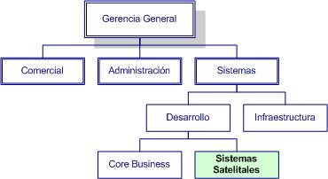
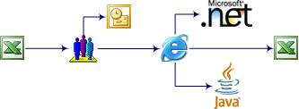

# Una visión de Doors para CIOs

**Fecha:** Septiembre 2006

---

## Un poco de historia

En empresas no informáticas que poseen áreas de sistemas, los sistemas se dividen en dos categorías:

- **Core business:** Sistemas que manejan el negocio principal de la empresa
- **Sistemas satelitales:** Aplicaciones secundarias pero numerosas

La cantidad de pequeños sistemas sin resolver genera insatisfacción general en la organización. Los recursos más productivos suelen ser aquellos que han aprendido a utilizar Excel como herramienta para resolver necesidades puntuales.

## Problemas de implementación en planillas Excel

Se identifican cinco problemas principales:

1. **Seguridad:** Información sensible circulando por correo sin protección
2. **Concurrencia:** Conflictos cuando múltiples usuarios necesitan acceder simultáneamente
3. **Integridad:** Riesgos en operaciones críticas (ej: liquidación de sueldos)
4. **Capacidad:** Limitaciones técnicas de las planillas
5. **Centralización:** Dificultad para consolidar información en reportes

## Lotus Notes como solución histórica

En los años 90, Lotus Notes fue percibido como la solución ideal porque:

- Estaba instalado como herramienta de mensajería
- Ofrecía excelente nivel de seguridad
- Proporcionaba herramientas de desarrollo accesibles
- Incluía diseñador de formularios, vistas y capacidades de búsqueda

## Transición a tecnologías web

Microsoft dominó el mercado con Outlook/Exchange, desplazando a Notes. Posteriormente, la "fiebre WEB" de finales de los 90 introdujo ASP, pero sin las herramientas integradas que tenía Notes.

.NET y Java requieren mayor inversión en desarrollo, lo que genera un retroceso hacia Excel como solución pragmática.

## Solución propuesta: Cloudy Doors BPM

Plataforma propia diseñada con estas características:

- Aprovechamiento máximo de bases de datos relacionales
- Herramientas documentales integradas:
  - Diseñador de formularios
  - Inteligencia de negocios programable
  - Diseñador de vistas
  - Seguridad a nivel de registro
  - Validación de usuarios
  - Manejo de archivos adjuntos
  - Indexación y búsquedas de texto
  - Motor de eventos
- 100% web
- Estructura jerárquica de carpetas
- Soporte para Oracle y SQL Server

---

Ver también: [Documentación Técnica Doors 7](INDEX.md)
